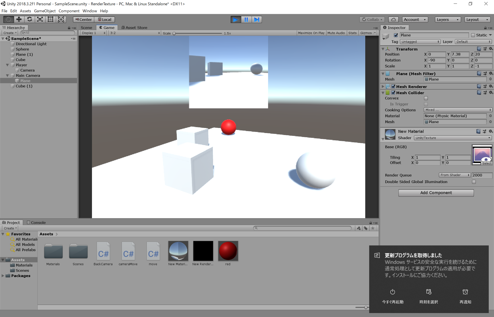

# 第4回：テクスチャへの描画

授業で作成したプロジェクトファイルをforkしたプロジェクトに上げてください。

今回は、2つのテーマを実装してもらいます。各フォルダにそれぞれのプロジェクトのファイルを入れてください。
.gitignore を反映させて、無駄なファイルをアップロードしないようにしてください。

自信のある結果画像をそれぞれのフォルダにresult.pngという名前で保存すること(表示されることを確認すること)

データの著作権に気を付けてください。

翌日以降の提出の際はプルリクを投げてください。
